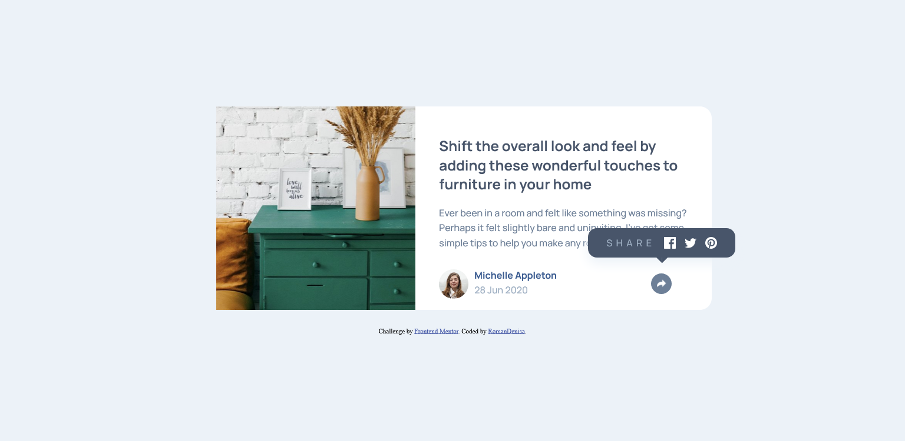
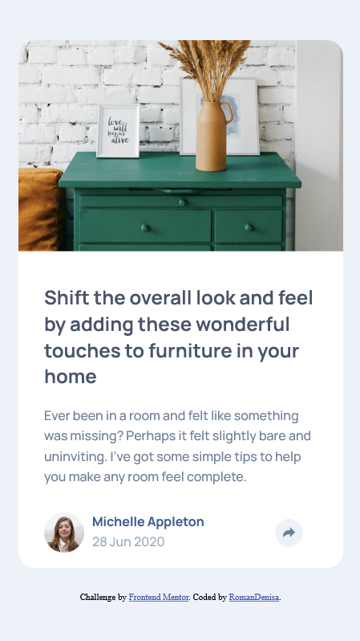

# Frontend Mentor - Article preview component solution

This is a solution to the [Article preview component challenge on Frontend Mentor](https://www.frontendmentor.io/challenges/article-preview-component-dYBN_pYFT). Frontend Mentor challenges help you improve your coding skills by building realistic projects. 

## Table of contents

- [Overview](#overview)
  - [The challenge](#the-challenge)
  - [Screenshot](#screenshot)
  - [Links](#links)
- [My process](#my-process)
  - [Built with](#built-with)
  - [What I learned](#what-i-learned)
  - [Continued development](#continued-development)
- [Author](#author)

## Overview

### The challenge

Users should be able to:

- View the optimal layout for the component depending on their device's screen size
- See the social media share links when they click the share icon

### Screenshot

### Links

- Live Site URL: [Live Site](https://romandenisa.github.io/FrontendMentorChallenges/article-preview-component/)

## My process

### Built with

- Semantic HTML5 markup
- Flexbox
- CSS Grid
- Mobile-first workflow
- JavaScript

### What I learned

In this project I had some more practice on flex box and css grid, as well as have a try at a mobile-first workflow.
I learned how to make a tooltip arrow using css, practiced media-queries, reponsiveness and accessibility. 

### Continued development

I will continue to exercise on the aspects that I used in this project and one of my objectives for now is to get more practice in JavaScript, as well as transitions and animations.
## Author

- Frontend Mentor - [@RomanDenisa](https://www.frontendmentor.io/profile/RomanDenisa)
